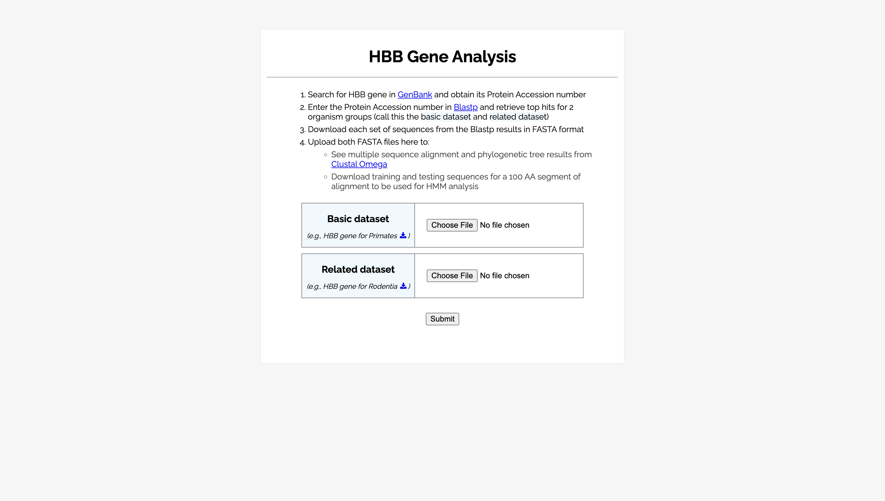
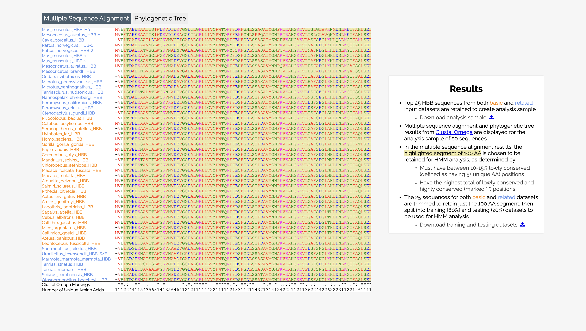
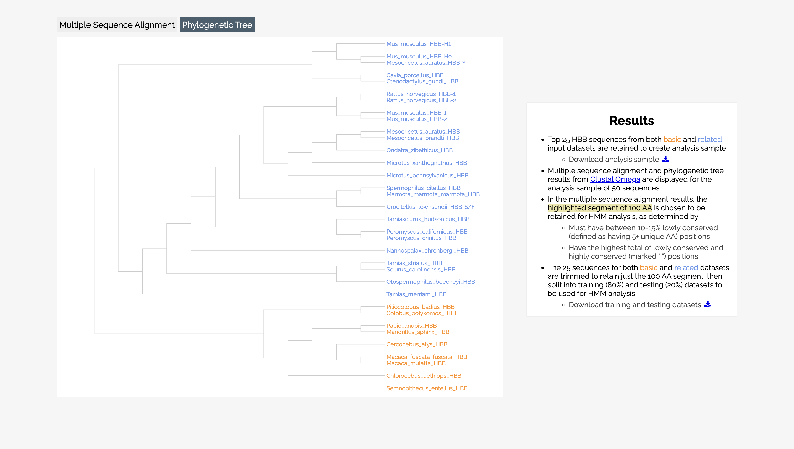

# Multiple Sequence Alignment Visualizer

Assess conservation of the hemoglobin subunit beta (HBB) gene across different species.

## Features

- **Built with Flask**: A web app for visualizing multiple sequence alignments using the Clustal Omega API
- **FASTA file upload**: Allows users to submit sequence data for alignment
- **Phylogenetic tree viewer**: Visualizes evolutionary relationships using D3.js
- **Conserved region detection**: Uses a sliding window approach to identify optimal sequence region for HMM analysis

## Product

- **Live project link**: https://project-cs123b.onrender.com
- **Tech stack**: Flask, Python, Jinja, JavaScript, CSS, D3.js, Clustal Omega API, Render

